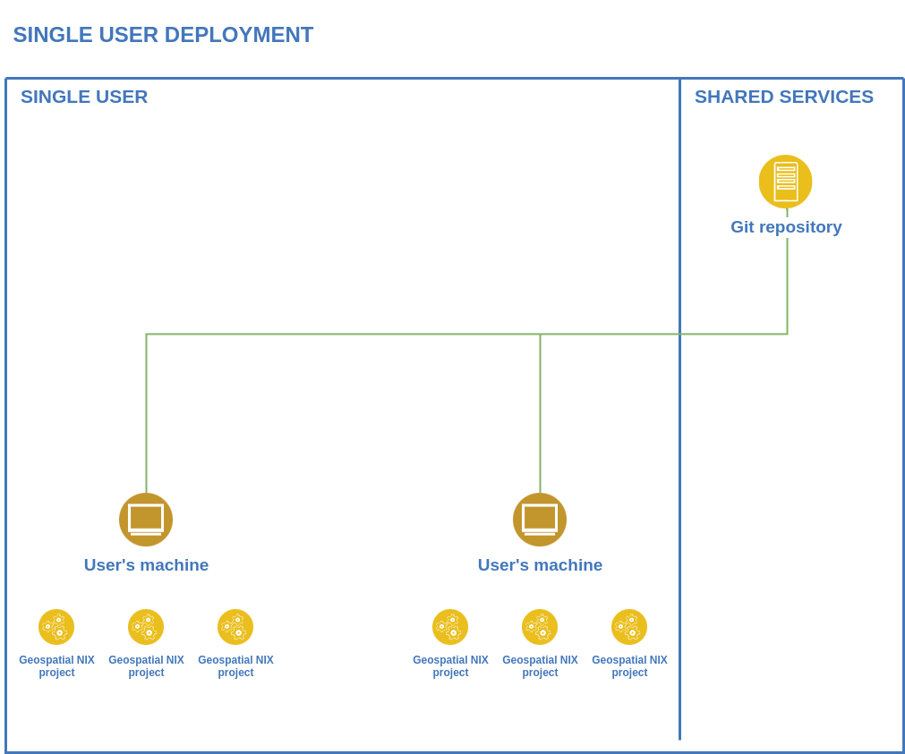

# Geospatial NIX Platform

The main objective of the "Geospatial NIX Platform" project is to
build a platform for practical hands-on education with a focus on
geospatial technologies, remote sensing and machine learning at high
school and university levels. The purpose of this platform is to run
isolated and reproducible environments created for each project or
exercise by [Geospatial NIX/Geospatial NIX.today](https://geospatial-nix.today/) by a teacher or a
student. This would allow users to build a collection of
self-contained (software, environment configuration, data, workflows)
classes which can be easily used by a teacher in a school lab or at
home by a student.

## Design

**Geospatial NIX Platform provides a runtime environment and desktop
user interface for running isolated per-project/per-class environments
created by Geospatial NIX.today.** It is based on a pre-built, custom
NixOS operating system image which can run on physical hardware or in
a virtual machine. The image is configured and built by a platform
administrator using Geospatial NIX Platform Web UI and custom NixOS
modules. Two deployment scenarios are supported:

- **single user deployment** - single user system suitable for home
  users
- **classroom deployment** - multi user system with additional
  services suitable for mass deployment

### Deployment scenarios 

#### Single User

In **Single User deployment mode**, Geospatial NIX Platform user
interface is deployed on a user's own, not-managed computer running
Linux, Mac OSX or MS Windows OS as a virtual machine (VM). A pre-built
VM image created by the platform administrator is available for
download from a local network or Internet.

#### Classroom

**Classroom deployment mode** consists of a single master server and
multiple desktop machines providing user interface. Master server can
be configured to provide multiple additional services such as Nix
binary cache, NFS storage, database storage, Jupyter Hub or Kubernetes
(K3S) cluster. User authentication is managed by AD/LDAP services
provided by the local host network. User machines are launched from a
local host network via HTTP boot and are centrally managed.

Design of this solution is based on experience gained during 
[GIS.lab](https://gislab.readthedocs.io) development and its production
use at the Czech Technical University in Prague and Charles University,
Czech Republic.
